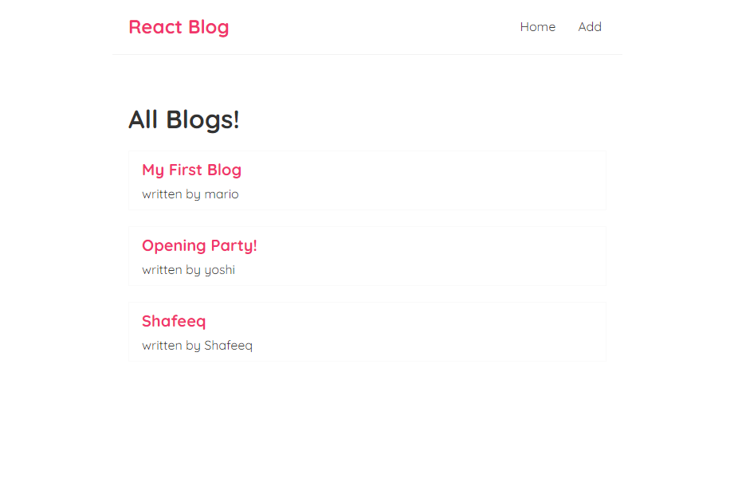

# React Blog

A simple React application for reading, creating, and deleting blogs <br>


## 📸 Screenshots
 


## Configuration
Before running the application, start the backend JSON server by navigating to `./data` and execute the following command:


```bash
npx json-server db.json --port=8000
```

## Build Setup
``` bash
# install dependencies
npm install

# serve with hot reload at localhost:3080
npm run start

# build for production with minification
npm run build

```
